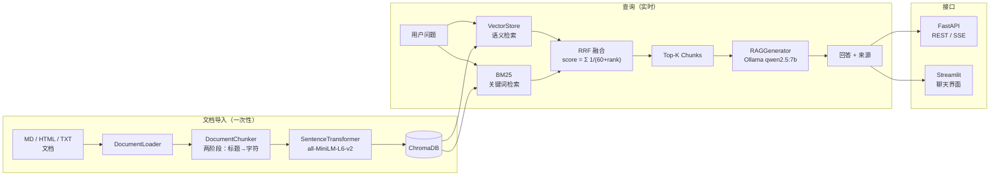

# LangChain 文档 AI 问答系统

> 基于混合检索（语义 + BM25 + RRF）的生产级 RAG 系统，完全本地运行，含完整评估框架。


---

## 系统架构



### 模块职责

| 模块 | 职责 |
|------|------|
| `src/config.py` | 所有可调参数的统一入口 |
| `src/document_pipeline/` | 加载 → 两阶段分块（标题切分 + 字符切分） |
| `src/embeddings/store.py` | SentenceTransformer 向量化 + ChromaDB 读写 |
| `src/retrieval/hybrid.py` | 语义检索 + BM25 并行，RRF 融合（0.7 / 0.3） |
| `src/generation/generator.py` | Prompt 拼装 + Ollama 调用 + SSE 流式输出 |
| `src/api/app.py` | FastAPI 应用（lifespan 生命周期管理） |
| `src/evaluation/evaluator.py` | 4 项规则评估，无需额外 API 调用 |
| `src/frontend/streamlit_app.py` | Streamlit 聊天界面，直接调用 Python 模块 |

---

## 核心功能

- **混合检索** — 余弦相似度 + BM25，通过 Reciprocal Rank Fusion 融合（`score = Σ 1/(60 + rank)`）
- **100 篇** LangChain 官方文档，最优配置下生成 **1,596 个 chunks**
- **完全离线** — 通过 Ollama 本地运行 qwen2.5:7b，无需云端 API
- **双接口** — RESTful API（FastAPI + Swagger UI）+ 交互式聊天前端（Streamlit）
- **评估框架** — 4 项指标（忠实度 / 答案相关性 / 上下文精度 / 上下文召回），零额外 API 消耗
- **实验驱动配置** — 对 256 / 512 / 1024 三种 chunk_size 做了对照实验并公开结果

---

## 评估结果

### Chunk Size 对比实验

> 语料：100 篇文档 | 测试集：10 条问题 | LLM：qwen2.5:7b | Embedding：all-MiniLM-L6-v2

| Chunk Size | Overlap | Chunks | Faithfulness | Answer Relevancy | Context Precision | Context Recall | Avg Latency | Composite ↑ |
|---:|---:|---:|---:|---:|---:|---:|---:|---:|
| 256 | 51 | 2,189 | 0.294 | 0.610 | 0.227 | 0.497 | 3,846 ms | 0.407 |
| **512** ⭐ | **102** | **1,596** | **0.305** | **0.645** | **0.237** | **0.507** | 3,998 ms | **0.424** |
| 1024 | 205 | 1,440 | 0.306 | 0.628 | 0.234 | 0.500 | 3,931 ms | 0.417 |

Composite = 四项指标等权平均。完整原始数据：[`eval/chunk_experiment_report.json`](eval/chunk_experiment_report.json)

### 分析

**答案相关性（Answer Relevancy）对 chunk_size 最敏感**（变化幅度：0.610 → 0.645，+5.7%）。chunk_size=512 约等于一个完整段落，既能提供足够上下文，又不会稀释 embedding 信号。

- **256** — 2,189 个细粒度 chunks。检索返回大量小片段，上下文不完整导致幻觉风险最高（Faithfulness 最低：0.294），Recall 也偏低。
- **512** — 1,596 个中等 chunks。Answer Relevancy（+5.7%）、Context Precision（+4.4%）、Context Recall（+2.0%）均领先，综合分最高：**0.424**。
- **1024** — 1,440 个粗粒度 chunks。Faithfulness 略高（0.306），因为完整上下文减少了幻觉；但 chunk 越大 embedding 被稀释，Precision 低于 512。

**延迟基本无差异**（各配置均约 3.9 s），瓶颈在 LLM 推理，chunk_size 不影响响应时间。

---

## 快速开始

### 前置条件

- Python 3.11+
- 安装并运行 [Ollama](https://ollama.ai)，拉取模型：

```bash
ollama pull qwen2.5:7b
```

### 安装

```bash
git clone https://github.com/GuddXzy/rag-from-scratch.git
cd rag-from-scratch

python -m venv .venv
.venv\Scripts\activate        # Windows
# source .venv/bin/activate   # macOS / Linux

pip install -e ".[dev]"
```

### 导入文档（一次性）

```bash
python -m scripts.ingest --docs-dir ./data/langchain_docs

# 清空后重新导入：
python -m scripts.ingest --docs-dir ./data/langchain_docs --reset
```

---

## 三种使用方式

### 方式一：Streamlit 聊天界面（推荐）

> 图形化交互界面，支持中英文切换，含系统状态面板和评估指标展示。

```bash
python -m streamlit run src/frontend/streamlit_app.py
```

浏览器访问 **http://localhost:8501**

功能亮点：
- 🌐 侧栏语言切换（中文 / English）
- 💬 多轮对话 + 引用来源折叠展示
- 📊 实时显示 ChromaDB chunk 数量、评估指标
- 🔖 一键填入示例问题

---

### 方式二：FastAPI REST 接口

> 标准 HTTP 接口，适合集成到其他应用或用 Apifox / Postman 调试。

```bash
python -m scripts.serve
# 开发模式（热重载）：
python -m scripts.serve --reload
```

浏览器访问 **http://localhost:8000/docs** 查看 Swagger UI

| 方法 | 路径 | 说明 |
|------|------|------|
| `GET`  | `/health`       | 健康检查 |
| `GET`  | `/stats`        | chunk 数量、模型信息 |
| `POST` | `/query`        | RAG 问答，返回 answer + sources |
| `POST` | `/query/stream` | 同上，逐 token SSE 流式输出 |
| `POST` | `/ingest`       | 从本地目录导入文档 |

```bash
# 示例请求
curl -X POST http://localhost:8000/query \
  -H "Content-Type: application/json" \
  -d '{"question": "What is LCEL?", "top_k": 5}'
```

---

### 方式三：命令行直接查询

> 无需启动任何服务，适合快速测试或脚本集成。

```bash
# 完整问答（检索 + LLM 生成）
python -m scripts.query "What is LCEL?"

# 仅检索，不调用 LLM（速度更快，不消耗计算资源）
python -m scripts.query "How does hybrid retrieval work?" --no-generate

# 指定返回条数
python -m scripts.query "What are agents?" --top-k 3
```

---

### Docker（一键启动 API）

```bash
docker compose up --build
# API 地址：http://localhost:8000
```

---

## 项目结构

```
rag-from-scratch/
├── src/
│   ├── config.py                      # 所有可调参数
│   ├── document_pipeline/
│   │   ├── loader.py                  # MD / HTML / TXT 文档加载
│   │   ├── chunker.py                 # 两阶段分块（标题 → 字符）
│   │   └── processor.py              # 串联 loader → chunker
│   ├── embeddings/
│   │   └── store.py                   # SentenceTransformer + ChromaDB
│   ├── retrieval/
│   │   └── hybrid.py                  # 语义 + BM25 + RRF 融合
│   ├── generation/
│   │   └── generator.py               # Prompt 拼装 + Ollama 调用 + SSE 流式
│   ├── api/
│   │   └── app.py                     # FastAPI 应用
│   ├── evaluation/
│   │   └── evaluator.py               # 4 项规则评估器
│   └── frontend/
│       └── streamlit_app.py           # Streamlit 聊天界面
├── scripts/
│   ├── ingest.py                      # CLI：导入文档
│   ├── query.py                       # CLI：单次查询
│   ├── serve.py                       # CLI：启动 API 服务
│   ├── evaluate.py                    # CLI：运行评估
│   ├── run_frontend.py                # CLI：启动 Streamlit
│   └── experiment_chunk_size.py      # chunk_size 对比实验
├── eval/
│   ├── test_set.json                  # 10 条评估问题
│   ├── chunk_experiment_report.json   # 实验原始数据（3 配置 × 10 问题）
│   └── chunk_experiment_summary.md   # 可读对比报告
├── data/
│   ├── langchain_docs/                # 源文档（MD / HTML，gitignored）
│   └── chroma_db/                     # ChromaDB 持久化（gitignored）
├── tests/
│   ├── test_pipeline.py               # 单元测试，无需下载模型
│   └── test_retrieval.py              # 集成测试，首次运行下载 ~80 MB 模型
├── Dockerfile
├── docker-compose.yml
└── pyproject.toml
```

---

## 运行测试

```bash
pytest tests/test_pipeline.py -v    # 快速，无需下载模型
pytest tests/test_retrieval.py -v   # 首次运行下载 ~80 MB 模型
pytest                               # 全部测试
```

---

## 技术选型说明

### ChromaDB 而非 Pinecone / Weaviate
ChromaDB 完全在进程内运行，无需独立服务、无 API Key、无流量费用。对于本地优先的项目，这消除了所有基础设施开销。切换到 Pinecone 只需替换 `src/embeddings/store.py` 中的一个适配器。

### 混合检索而非纯语义检索
纯余弦相似度在精确关键词查询（API 方法名、类名、参数标志）上表现差，BM25 恰好擅长这类场景。RRF 融合无需对不同检索器的分数做归一化，天然兼容异构分数。权重（0.7 语义 / 0.3 BM25）可在 `src/config.py` 中调整。

### 本地 LLM（Ollama）而非云端 API
支持完全离线运行，无 API 费用，无数据外传，评估循环（3 种配置 × 10 条问题）无速率限制。生成器与后端无关，切换到 `claude-sonnet-4-6` 只需改 `config.py` 一行。

### chunk_size=512 — 实验结论，非经验猜测
通过对照实验选定。512 字符 ≈ 一个完整段落 ≈ 一个完整概念。Answer Relevancy 领先 256 配置 +5.7%，Context Precision +4.4%，Context Recall +2.0%，延迟差异可忽略（+152 ms）。完整数据：`eval/chunk_experiment_report.json`。

---

## 后续改进方向

1. **Cross-encoder 重排序** — 引入 `ms-marco-MiniLM` 对 Top-K chunks 做二次排序，提升 Context Precision
2. **多轮记忆** — 通过 `ConversationBufferMemory` 持久化对话历史，支持连贯的追问
3. **更大本地模型** — qwen2.5:7b 换为 qwen2.5:14b 或 llama3.1:8b；生成器与模型无关，直接换配置
4. **评估 CI** — 在 GitHub Actions 中每次 PR 自动运行 `scripts/evaluate.py`，综合分低于阈值则构建失败
5. **增量文档更新** — 定时爬取 + 增量导入，保持知识库与 LangChain 官方文档同步

---

## 运行测试

```bash
pytest tests/test_pipeline.py -v    # 快速，无需下载模型
pytest tests/test_retrieval.py -v   # 首次运行下载 ~80 MB 模型
pytest                               # 全部测试
```

---

## License

MIT

---

## English Version

<details>
<summary>Click to expand</summary>

### Quick Start

**Prerequisites:** Python 3.11+, [Ollama](https://ollama.ai) running locally.

```bash
git clone https://github.com/GuddXzy/rag-from-scratch.git
cd rag-from-scratch
python -m venv .venv && .venv\Scripts\activate   # Windows
pip install -e ".[dev]"
ollama pull qwen2.5:7b
python -m scripts.ingest --docs-dir ./data/langchain_docs
```

### Method 1 — Streamlit Chat UI (Recommended)

> Bilingual interface (Chinese / English toggle in sidebar), chat history, source citations.

```bash
python -m streamlit run src/frontend/streamlit_app.py
# Open: http://localhost:8501
```

### Method 2 — FastAPI REST API

> Standard HTTP interface with auto-generated Swagger docs.

```bash
python -m scripts.serve
# Open: http://localhost:8000/docs
```

```bash
curl -X POST http://localhost:8000/query \
  -H "Content-Type: application/json" \
  -d '{"question": "What is LCEL?", "top_k": 5}'
```

| Method | Path | Description |
|--------|------|-------------|
| `GET`  | `/health`       | Health check |
| `GET`  | `/stats`        | Chunk count, model info |
| `POST` | `/query`        | RAG Q&A → answer + sources |
| `POST` | `/query/stream` | Streaming SSE output |
| `POST` | `/ingest`       | Import documents |

### Method 3 — Command Line

> No server needed, great for scripting or quick tests.

```bash
python -m scripts.query "What is LCEL?"
python -m scripts.query "What is LCEL?" --no-generate   # retrieve only, skip LLM
```

### Features

- **Hybrid Retrieval** — cosine similarity + BM25 fused via RRF (`score = Σ 1/(60 + rank)`)
- **100 pages** of LangChain official docs, **1,596 chunks** at optimal chunk_size=512
- **Fully offline** — Ollama qwen2.5:7b, no cloud API
- **Bilingual UI** — Streamlit frontend with Chinese / English toggle
- **Evaluation** — 4 metrics (Faithfulness / Answer Relevancy / Context Precision / Recall)

### Tech Decisions

- **ChromaDB** — zero-infrastructure, in-process; swap to Pinecone with one adapter change
- **Hybrid retrieval** — BM25 handles exact keyword matches that pure cosine similarity misses
- **Ollama** — fully offline, no API cost, model-agnostic generator
- **chunk_size=512** — empirically selected; leads in 3 of 4 metrics vs. 256 and 1024

</details>
