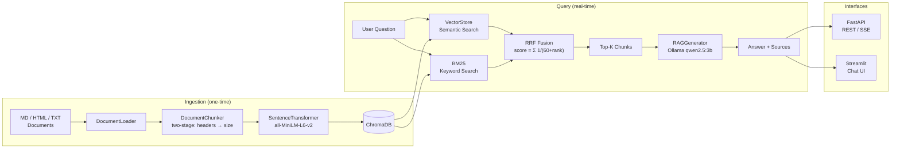

# LangChain Docs AI Assistant

> A production-grade RAG system for querying LangChain documentation — hybrid semantic + BM25 retrieval, local LLM, full evaluation framework.


---

## Architecture



### Module Responsibilities

| Module | Role |
|--------|------|
| `src/config.py` | Single source of truth for all tunable parameters |
| `src/document_pipeline/` | Load → two-stage chunk (header split then character split) |
| `src/embeddings/store.py` | SentenceTransformer embeddings + ChromaDB CRUD |
| `src/retrieval/hybrid.py` | Parallel semantic + BM25 search, fused with RRF (0.7 / 0.3) |
| `src/generation/generator.py` | Prompt assembly, Ollama call, streaming via SSE |
| `src/api/app.py` | FastAPI app with lifespan context manager |
| `src/evaluation/evaluator.py` | 4-metric rule-based evaluator (no extra API calls) |
| `src/frontend/streamlit_app.py` | Interactive chat UI, direct Python module calls |

---

## Features

- **Hybrid Retrieval** — cosine similarity + BM25 fused via Reciprocal Rank Fusion (`score = Σ 1/(60 + rank)`)
- **100 pages** of LangChain official documentation, **1,596 chunks** at optimal chunk_size=512
- **Fully offline** — local LLM via Ollama (qwen2.5:3b), no cloud API required
- **Dual interface** — RESTful API (FastAPI + Swagger UI) + interactive chat frontend (Streamlit)
- **Evaluation framework** — 4 metrics (Faithfulness, Answer Relevancy, Context Precision, Context Recall) with zero additional API cost
- **Empirical chunk size selection** — controlled experiment across 256 / 512 / 1024 with published results

---

## Evaluation Results

### Chunk Size Experiment

> Corpus: 100 docs | Test set: 10 questions | LLM: qwen2.5:3b | Embedding: all-MiniLM-L6-v2

| Chunk Size | Overlap | Chunks | Faithfulness | Answer Relevancy | Context Precision | Context Recall | Avg Latency | Composite ↑ |
|---:|---:|---:|---:|---:|---:|---:|---:|---:|
| 256 | 51 | 2,189 | 0.294 | 0.610 | 0.227 | 0.497 | 3,846 ms | 0.407 |
| **512** ⭐ | **102** | **1,596** | **0.305** | **0.645** | **0.237** | **0.507** | 3,998 ms | **0.424** |
| 1024 | 205 | 1,440 | 0.306 | 0.628 | 0.234 | 0.500 | 3,931 ms | 0.417 |

Composite = equal-weight average of four metrics. Full raw data: [`eval/chunk_experiment_report.json`](eval/chunk_experiment_report.json).

### Analysis

**Answer Relevancy is the most chunk-size-sensitive metric** (range: 0.610 → 0.645, +5.7%).
chunk_size=512 hits the sweet spot where each chunk approximates one complete paragraph — enough context to answer a question without diluting the embedding with off-topic content.

- **256** — 2,189 fine-grained chunks. Retrieval returns many small fragments; incomplete context increases hallucination risk (lowest Faithfulness: 0.294) and lowers Recall.
- **512** — 1,596 medium chunks. Leads in Answer Relevancy (+5.7% vs. 256), Context Precision (+4.4%), and Context Recall (+2.0%). Best composite: **0.424**.
- **1024** — 1,440 coarse chunks. Slightly highest Faithfulness (0.306) because full-context chunks reduce hallucination, but embedding dilution hurts Precision vs. 512.

**Latency is effectively neutral** (~3.9 s across all configs), dominated by LLM inference — chunk size does not meaningfully affect response time.

---

## Quick Start

### Prerequisites

- Python 3.11+
- [Ollama](https://ollama.ai) installed and running

```bash
ollama pull qwen2.5:3b
```

### Install

```bash
git clone https://github.com/your-username/langchain-docs-rag.git
cd langchain-docs-rag

python -m venv .venv
# Windows:
.venv\Scripts\activate
# macOS / Linux:
source .venv/bin/activate

pip install -e ".[dev]"
```

### Ingest Documents

```bash
python -m scripts.ingest --docs-dir ./data/langchain_docs

# Clear and re-ingest from scratch
python -m scripts.ingest --docs-dir ./data/langchain_docs --reset
```

### Run

```bash
# Streamlit chat UI  →  http://localhost:8501
python -m streamlit run src/frontend/streamlit_app.py

# FastAPI REST API  →  http://localhost:8000/docs (Swagger UI)
python -m scripts.serve
python -m scripts.serve --reload        # hot reload for development

# CLI query (no server needed)
python -m scripts.query "What is LCEL?"
python -m scripts.query "What is LCEL?" --no-generate   # retrieval only, no LLM call

# Evaluation
python -m scripts.evaluate
python -m scripts.evaluate --output ./eval/results.json
```

### Docker

```bash
docker compose up --build
# API available at http://localhost:8000
```

---

## Project Structure

```
langchain-docs-rag/
├── src/
│   ├── config.py                      # All tunable parameters
│   ├── document_pipeline/
│   │   ├── loader.py                  # MD / HTML / TXT file loader
│   │   ├── chunker.py                 # Two-stage chunking (headers → character size)
│   │   └── processor.py              # Orchestrates loader → chunker
│   ├── embeddings/
│   │   └── store.py                   # SentenceTransformer + ChromaDB CRUD
│   ├── retrieval/
│   │   └── hybrid.py                  # Semantic + BM25 + RRF fusion
│   ├── generation/
│   │   └── generator.py               # Prompt assembly + Ollama call + SSE streaming
│   ├── api/
│   │   └── app.py                     # FastAPI app with lifespan context manager
│   ├── evaluation/
│   │   └── evaluator.py               # 4-metric rule-based evaluator
│   └── frontend/
│       └── streamlit_app.py           # Streamlit chat UI (direct module calls)
├── scripts/
│   ├── ingest.py                      # CLI: ingest documents into ChromaDB
│   ├── query.py                       # CLI: one-shot query
│   ├── serve.py                       # CLI: start FastAPI server
│   ├── evaluate.py                    # CLI: run evaluation suite
│   ├── run_frontend.py                # CLI: start Streamlit
│   └── experiment_chunk_size.py      # Chunk size comparison experiment
├── eval/
│   ├── test_set.json                  # 10-question evaluation set
│   ├── chunk_experiment_report.json   # Raw experiment data (all 3 configs × 10 questions)
│   └── chunk_experiment_summary.md   # Human-readable comparison report
├── data/
│   ├── langchain_docs/                # Source documents (MD / HTML)
│   └── chroma_db/                     # ChromaDB persistence directory
├── tests/
│   ├── test_pipeline.py               # Unit tests — no model download required
│   └── test_retrieval.py              # Integration tests — downloads ~80 MB embedding model
├── Dockerfile
├── docker-compose.yml
└── pyproject.toml
```

---

## API Reference

Base URL: `http://localhost:8000` | Interactive docs: `/docs`

| Method | Endpoint | Description |
|--------|----------|-------------|
| `GET` | `/health` | Liveness check — returns `{"status": "ok"}` |
| `GET` | `/stats` | Chunk count, collection name, model names |
| `POST` | `/query` | RAG query → `answer`, `sources`, `retrieval_results`, `latency_ms` |
| `POST` | `/query/stream` | Same as `/query` with token-by-token SSE streaming |
| `POST` | `/ingest` | Ingest documents from a local directory path |

**Example:**

```bash
curl -X POST http://localhost:8000/query \
  -H "Content-Type: application/json" \
  -d '{"question": "What is LCEL?", "top_k": 5}'
```

```json
{
  "answer": "LCEL (LangChain Expression Language) is a declarative way to compose chains...",
  "sources": ["langchain_overview.md", "langchain_lcel.md"],
  "latency_ms": 3241.5
}
```

---

## Tech Decisions & Trade-offs

### ChromaDB over Pinecone / Weaviate
ChromaDB runs fully in-process — no separate Docker service, no API keys, no egress costs. For a local-first project this eliminates infrastructure overhead entirely. Switching to Pinecone requires only a single adapter swap in `src/embeddings/store.py`.

### Hybrid retrieval over pure semantic search
Pure cosine similarity struggles with exact-match queries (API method names, class names, flags). BM25 handles these precisely. RRF fusion combines both signals without requiring score normalisation across incompatible scales. Weights (0.7 semantic / 0.3 BM25) are configurable in `src/config.py`.

### Local LLM (Ollama) over cloud API
Enables fully offline operation — no API cost, no data leaving the machine, no rate limits during evaluation loops that iterate over all 3 chunk configs × 10 questions. The generator is backend-agnostic; switching to `claude-sonnet-4-6` requires one line in `config.py`.

### chunk_size=512 — empirical, not heuristic
Selected by controlled experiment. 512 characters ≈ one paragraph ≈ one complete concept. It leads in Answer Relevancy (+5.7% vs. 256), Context Precision (+4.4%), and Context Recall (+2.0%), with negligible latency difference (+152 ms). Full data: `eval/chunk_experiment_report.json`.

---

## Future Improvements

1. **Cross-encoder re-ranker** — add `ms-marco-MiniLM` to re-rank top-K chunks before generation, targeting higher Context Precision
2. **Multi-turn memory** — persist conversation history via LangChain `ConversationBufferMemory` for coherent follow-up questions
3. **Larger local model** — swap qwen2.5:3b for qwen2.5:7b or llama3.1:8b; the generator module is model-agnostic
4. **Evaluation CI** — run `scripts/evaluate.py` on every PR via GitHub Actions; fail build if composite score drops below threshold
5. **Incremental document refresh** — scheduled crawl + delta ingest to keep the knowledge base in sync with LangChain's live documentation

---

## Running Tests

```bash
pytest tests/test_pipeline.py -v    # fast, no model download
pytest tests/test_retrieval.py -v   # downloads ~80 MB embedding model on first run
pytest                               # all tests
```

---

## License

MIT
